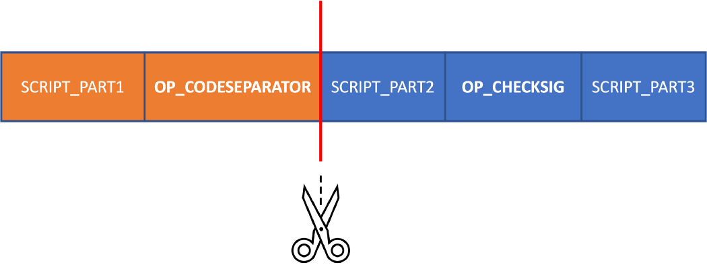

==================
Standard Contracts
==================

Multiple Contracts
==================
A single file can define multiple contracts. In this case, the last contract acts as the main contract and is what gets compiled.
Other contracts are dependencies.

In the following example, a standard P2PKH contract is rewritten using two other contracts: a hash puzzle contract that checks the public key matches the public key hash, and a Pay-to-PubKey (P2PK) contract that verifies signature matches public key.

.. code-block:: solidity

    contract HashPuzzle {
        Ripemd160 hash;

        public function spend(bytes preimage) {
            require(hash160(preimage) == this.hash);
        }
    }

    contract Pay2PubKey {
        PubKey pubKey;

        public function spend(Sig sig) {
            require(checkSig(sig, this.pubKey));
        }
    }

    contract Pay2PubKeyHash {
        Ripemd160 pubKeyHash;

        public function spend(Sig sig, PubKey pubKey) {
            HashPuzzle hp = new HashPuzzle(this.pubKeyHash);
            require(hp.spend(pubKey));

            Pay2PubKey p2pk = new Pay2PubKey(pubKey);
            require(p2pk.spend(sig));
        }
    }

import
======
Alternatively, the contract above can be broken into three files. The ``Pay2PubKeyHash`` contact ``import``\s other two contracts as dependencies.
This allows reusing contracts written by others and forms the basis of contract libraries.

A contract can be instantiated by ``new``. A ``public`` function can be called from ``require``, which takes boolean expression as input.

.. code-block:: solidity

    import "./hashPuzzle.scrypt";
    import "./p2pk.scrypt";

    contract Pay2PubKeyHash {
        Ripemd160 pubKeyHash;

        public function spend(Sig sig, PubKey pubKey) {
            HashPuzzle hp = new HashPuzzle(this.pubKeyHash);
            require(hp.spend(pubKey));

            Pay2PubKey p2pk = new Pay2PubKey(pubKey);
            require(p2pk.spend(sig));
        }
    }

Library
=======
A library is the same with a contract, except it does not contain any public function. It is only intended to be imported by a contract or other libraries.
It thus cannot be independently deployed and called. It is frequently used to group related constants and static functions.

.. code-block:: solidity

    library Util {
        // number of bytes to denote some numeric value
        static const int DataLen = 1;
        // number of bytes to denote length serialized state, including varint prefix (1 byte) + length (2 bytes), change length to 4 when you need PushData4
        static const int StateLen = 3;

        // convert signed integer `n` to unsigned integer of `l` bytes, in little endian
        static function toLEUnsigned(int n, int l): bytes {
            // one extra byte to accommodate possible negative sign byte
            bytes m = num2bin(n, l + 1);
            // remove sign byte
            return m[0 : len(m) - 1];
        }
    }

Standard Contracts
==================
sCrypt comes with standard libraries that define many commonly used contracts. They are included by default and do not require explicit ``import`` to be used.

Library ``Utils``
-----------------

The ``Utils`` library provides a set of commonly used utility functions, such as function ``Utils.fromLEUnsigned`` 
converts signed integer ``n`` to unsigned integer of ``l`` bytes, in little endian. And function ``buildOutput(bytes outputScript, int outputSatoshis) : bytes``
to build a tx output from its script and satoshi amount.

The following example shows usage of the standard library ``Utils`` that corresponds to ``RabinSignature`` contract.

.. code-block:: solidity

  library RabinSignature {
      static function checkSig(bytes msg, RabinSig sig, RabinPubKey pubKey) : bool {
          int h = Utils.fromLEUnsigned(hash(msg + sig.padding));
          return (sig.s * sig.s) % pubKey == h % pubKey;
      }

      static function hash(bytes x) : bytes {
          // expand into 512 bit hash
          bytes hx = sha256(x);
          int idx = len(hx) / 2;
          return sha256(hx[: idx]) + sha256(hx[idx :]);
      }
  }

.. _pushtx-label:

Library ``Tx``
-----------------------
One grave misconception regarding bitcoin script is that its access is only limited to the data provided in the locking script and corresponding unlocking script.
Thus, its scope and capability are greatly underestimated.

sCrypt comes with a powerful library called ``Tx`` that allows inspection of the **ENTIRE TRANSACTION** containing the contract itself, besides the locking script and unlocking script.
It can be regarded as a pseudo opcode ``OP_PUSH_TX`` that pushes the current transaction into the stack, which can be inspected at runtime.
More precisely, it enables inspection of the preimage used in signature verification defined in `BIP143`_.
The format of the preimage is as follows:

    1. nVersion of the transaction (4-byte little endian)
    2. hashPrevouts (32-byte hash)
    3. hashSequence (32-byte hash)
    4. outpoint (32-byte hash + 4-byte little endian) 
    5. scriptCode of the input (serialized as scripts inside CTxOuts)
    6. value of the output spent by this input (8-byte little endian)
    7. nSequence of the input (4-byte little endian)
    8. hashOutputs (32-byte hash)
    9. nLocktime of the transaction (4-byte little endian)
    10. sighash type of the signature (4-byte little endian)

As an example, contract ``CheckLockTimeVerify`` ensures coins are timelocked and cannot be spent before ``matureTime`` is reached, similar to `OP_CLTV`_.

.. code-block:: solidity

    contract CheckLockTimeVerify {
        int matureTime;

        public function spend(SigHashPreimage txPreimage) {
            // using Tx.checkPreimage() to verify txPreimage
            require(Tx.checkPreimage(txPreimage));

            require(SigHash.nLocktime(txPreimage) >= this.matureTime);
        }
    }

More details can be found in this article `OP_PUSH_TX`_.
To customize ECDSA signing, such as choosing sighash type, there is a version called ``Tx.checkPreimageSigHashType()``
that supports custom sighash type. To customize ephemeral key, there is a more general version called ``Tx.checkPreimageAdvanced()``. see `Advanced OP_PUSH_TX`_.

ScriptCode of preimage usually contains the entire locking script. The only exception is when there is OP_CODESEPARATOR (OCS) in it. 
In this case, the scriptCode is the locking script but removing everything up to and including the last executed OCS before `OP_CHECKSIG`_ is executed.

The ``Tx`` library provides a set of OCS version methods to check this preimage that does not contain a complete locking script.
In many cases, scriptCode, or portion of it, is not needed when using OP_PUSH_TX. OCS can be used to cut its size. 
For example, in the following contract, only nLocktime, of the whole preimage is needed. We use ``Tx.checkPreimageOCS()``, a variant of the conventional ``Tx.checkPreimage()``. 
The only difference is that an OCS is inserted right before OP_CHECKSIG within the former. 
Also note we put ``Tx.checkPreimageOCS()`` as the last statement for maximal optimization.

.. code-block:: solidity

  contract CheckLockTimeVerifyOCS {
      int matureTime;

      public function unlock(SigHashPreimage preimage) {
          require(SigHash.nLocktime(preimage) > this.matureTime);
          require(Tx.checkPreimageOCS(preimage));
      }
  }

Library ``SigHash``
-----------------------
sCrypt also provides a ``SigHash`` library to access various fields in the preimage. 
For example, we usually use ``SigHash.scriptCode`` to access the ``scriptCode`` of the preimage, and use 
``SigHash.value`` to access the value field of the preimage, which is the value of the number of bitcoins
spent in this contract.

.. code-block:: solidity

  contract Clone {

      public function unlock(SigHashPreimage txPreimage) {
          require(Tx.checkPreimage(txPreimage));

          bytes scriptCode = SigHash.scriptCode(txPreimage);
          int satoshis = SigHash.value(txPreimage);
          bytes output = Utils.buildOutput(scriptCode, satoshis);
          require(hash256(output) == SigHash.hashOutputs(txPreimage));
      }
  }

Library ``HashedMap``
-----------------------

The `HashedMap` library provides a map/hashtable-like data structure.
Unique keys and their corresponding values are hashed before being stored.
Most functions of `HashedMap` require not only a key, but also its index, ranked by key hash in ascending order.

**Constructor**

* ``HashedMap(bytes data)``
  Create an instance of ``HashedMap`` with some initial data.

    .. code-block:: solidity

        HashedMap<bytes, int> map = new HashedMap<bytes, int>(b'');
        // key and value types can be omitted
        HashedMap<int, bool> map1 = new HashedMap(b'');
        // key and value types cannot be omitted since they cannot be inferred
        auto map2 = new HashedMap<int, int>(b'');

**Instance methods**

* ``set(K key, V val, int keyIndex) : bool``
  Insert or update a (`key`, `val`) pair with the key index given by `keyIndex`. Returns `true` if successful; otherwise returns `false`.

    .. code-block:: solidity

        require(map.set(b'1234', 1, 0)); // insert
        require(map.set(b'1234', 2, 0)); // update it

* ``canGet(K key, V val, int keyIndex): bool``
  Check whether we can get a (`key`, `val`) pair with the key index given by `keyIndex`. Returns `true` if successful; otherwise returns `false`.

    .. code-block:: solidity

        require(map.canGet(b'1234', 2, 0));

* ``has(K key, int keyIndex) : bool``
  Check whether `key` exists in the map and its index is `keyIndex`. Returns `true` if both conditions are met; otherwise returns `false`.

    .. code-block:: solidity

        require(map.has(b'1234', 0));

* ``delete(K key, int keyIndex) : bool``
  Delete the entry with given `key` and the key index is `keyIndex`. Returns `true` if successful; otherwise returns `false`.

    .. code-block:: solidity

        require(map.delete(b'1234', 0));

* ``clear() : bool``
  Delete all entries of the map.

    .. code-block:: solidity

        map.clear();

* ``size() : int``
  Returns the size of map, i.e. the number of the keys it contains.

    .. code-block:: solidity

        int s = map.size();

* ``data() : bytes``
  Returns the internal data representation of the map.

    .. code-block:: solidity

        bytes b = map.data();
        // this creates a deep copy of the map
        HashedMap<int, bool> mapCopy = new HashedMap(b);

Library ``HashedSet``
-----------------------

The `HashedSet` library provides a set-like data structure.
It can be regarded as a special `HashedMap` where a value is the same with its key and is thus omitted.
Unique values are hashed before being stored.
Most functions of `HashedSet` require an index, ranked by the value's sha256 hash in ascending order.

**Constructor**

* ``HashedSet(bytes data)``
  Create an instance of ``HashedSet`` with some initial data.

    .. code-block:: solidity
      
        struct ST {
          int x;
          bool y;
        }

        HashedSet<ST> set = new HashedSet<ST>(b'');
        // key and value types can be omitted
        HashedSet<ST> set1 = new HashedSet(b'');
        // key and value types cannot be omitted since they cannot be inferred
        auto set2 = new HashedSet<ST>(b'');

**Instance methods**

* ``add(E entry, int index) : bool``
  Add `entry` to set with the key index given by `index`. Returns `true` if successful; otherwise returns `false`.

    .. code-block:: solidity

        require(set.add(b'1234', 0));

* ``has(E entry, int index) : bool``
  Check whether `entry` exists in the set and its index is `index`. Returns `true` if both conditions are met; otherwise returns `false`.

    .. code-block:: solidity

        require(set.has(b'1234', 0));

* ``delete(E entry, int index) : bool``
  Delete the entry with given `entry` and the index is `index`. Returns `true` if successful; otherwise returns `false`.

    .. code-block:: solidity

        require(set.delete(b'1234', 0));

* ``clear() : bool``
  Delete all entries of the set.

    .. code-block:: solidity

        set.clear();

* ``size() : int``
  Returns the size of set, i.e. the number of the entries it contains.

    .. code-block:: solidity

        int s = set.size();

* ``data() : bytes``
  Returns the internal data representation of the set.

    .. code-block:: solidity

        bytes b = set.data();
        // this creates a deep copy of the set
        HashedSet<ST> setCopy = new HashedSet(b);

Library ``Constants``
-----------------------

sCrypt defines some commonly used constant values in the library ``Constants``.
You can use these constants anywhere in your code

    .. code-block:: solidity

      library Constants {

          // number of bytes to denote input sequence
          static const int InputSeqLen = 4;
          // number of bytes to denote output value
          static const int OutputValueLen = 8;
          // number of bytes to denote a public key (compressed)
          static const int PubKeyLen = 33;
          // number of bytes to denote a public key hash
          static const int PubKeyHashLen = 20;
          // number of bytes to denote a tx id
          static const int TxIdLen = 32;
          // number of bytes to denote a outpoint
          static const int OutpointLen = 36;
      }

Full List
---------

.. list-table::
    :header-rows: 1
    :widths: 20 20 20

    * - Contract 
      - Constructor parameters
      - Public function

    * - Utils
      - None
      - | toLEUnsigned(int n, int l) : bytes
        | fromLEUnsigned(bytes b) : int
        | readVarint(bytes b) : bytes
        | writeVarint(bytes b) : bytes
        | buildOutput(bytes outputScript, int outputSatoshis) : bytes
        | buildPublicKeyHashScript(PubKeyHash pubKeyHash) : bytes
        | buildOpreturnScript(bytes data) : bytes
        | isFirstCall(SigHashPreimage preimage) : bool // return whether is the first call of series public function calls in stateful contract

    * - Tx
      - None
      - | checkPreimage(SigHashPreimage preimage) : bool
        | checkPreimageOpt(SigHashPreimage rawTx) : bool
        | checkPreimageOpt\_(SigHashPreimage rawTx) : bool      // set sigHashType in ASM
        | checkPreimageSigHashType(SigHashPreimage txPreimage, SigHashType sigHashType) : bool
        | checkPreimageAdvanced(SigHashPreimage rawTx, PrivKey privKey, PubKey pubKey, int inverseK, int r, bytes rBigEndian, SigHashType sigHashType) : bool
        | checkPreimageOCS(SigHashPreimage preimage) : bool
        | checkPreimageOptOCS(SigHashPreimage rawTx) : bool
        | checkPreimageOptOCS\_(SigHashPreimage rawTx) : bool   // set sigHashType in ASM
        | checkPreimageSigHashTypeOCS(SigHashPreimage txPreimage, SigHashType sigHashType) : bool
        | checkPreimageAdvancedOCS(SigHashPreimage rawTx, PrivKey privKey, PubKey pubKey, int inverseK, int r, bytes rBigEndian, SigHashType sigHashType) : bool

    * - SigHash
      - None
      - | nVersion(SigHashPreimage preimage) : bytes
        | hashPrevouts(SigHashPreimage preimage) : bytes
        | hashSequence(SigHashPreimage preimage) : bytes
        | outpoint(SigHashPreimage preimage) : bytes
        | scriptCode(SigHashPreimage preimage) : bytes
        | valueRaw(SigHashPreimage preimage) : bytes
        | value(SigHashPreimage preimage) : int
        | nSequenceRaw(SigHashPreimage preimage) : bytes
        | nSequence(SigHashPreimage preimage) : int
        | hashOutputs(SigHashPreimage preimage) : bytes
        | nLocktimeRaw(SigHashPreimage preimage) : bytes
        | nLocktime(SigHashPreimage preimage) : int
        | sigHashType(SigHashPreimage preimage) : SigHashType

    * - HashedMap<K, V>
      - bytes data
      - | set(K key, V val, int keyIndex) : bool
        | canGet(K key, V val, int keyIndex) : bool
        | delete(K key, int keyIndex) : bool
        | has(K key, int keyIndex) : bool
        | clear() : bool
        | size() : int
        | data() : bytes

    * - HashedSet<V>
      - bytes data
      - | add(V val, int index) : bool
        | delete(V val, int index) : bool
        | has(V val, int index) : bool
        | clear() : bool
        | size() : int
        | data() : bytes

.. _BIP143: https://github.com/bitcoin-sv/bitcoin-sv/blob/master/doc/abc/replay-protected-sighash.md
.. _OP_CLTV: https://en.bitcoin.it/wiki/Timelock#CheckLockTimeVerify
.. _OP_PUSH_TX: https://medium.com/@xiaohuiliu/op-push-tx-3d3d279174c1
.. _Advanced OP_PUSH_TX: https://medium.com/@xiaohuiliu/advanced-op-push-tx-78ce84f69a66
.. _OP_PUSH_TX 技术: https://blog.csdn.net/freedomhero/article/details/107306604
.. _高级 OP_PUSH_TX 技术: https://blog.csdn.net/freedomhero/article/details/107333738
.. _OP_CHECKSIG: https://wiki.bitcoinsv.io/index.php/OP_CHECKSIG

