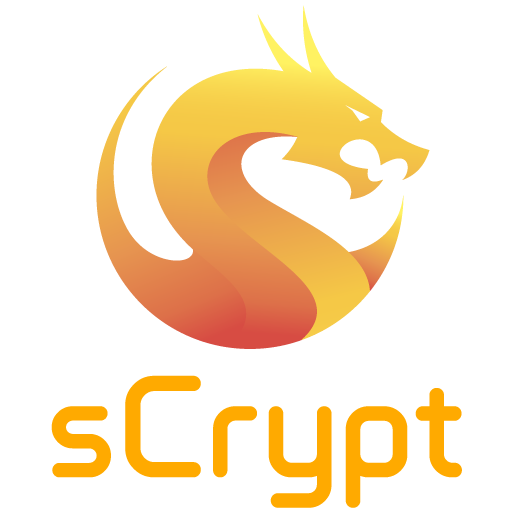

=============================
The sCrypt Language Reference
=============================

    
.. deprecated:: **Notice**: The sCrypt language has transitioned to a TypeScript-based SDK for an improved developer experience. Please refer to the updated documentation and resources at `https://docs.scrypt.io <https://docs.scrypt.io>`_ to learn more.

sCrypt (pronounced “ess crypt”) is a high-level smart contract language for Bitcoin SV.
Bitcoin supports smart contract with its Forth-like stack based Script language. 
However writing smart contract in native Script is cumbersome and error-prone.
It quickly becomes intractable when the contract size and complexity grow.

sCrypt is designed to facilitate writing smart contract running on chain.

* It is easy to learn. Syntactically, sCrypt is similar to Javascript and Solidity, making it easier to be adopted by existing web and smart contract developers.
* It is statically typed. Type checking can help detect many errors at compile time.

.. Warning:: sCrypt is still in experimental phase and is currently only intended for small amount usage.

.. toctree::
   :maxdepth: 2
   :caption: Introduction

   intro
   ide

.. toctree::
   :maxdepth: 2
   :caption: Language Specification

   syntax
   loop
   functions
   contracts
   ctc
   state

.. toctree::
   :maxdepth: 1
   :caption: sCrypt by Example

   p2pkh
   rpuzzle
   ackermann
   rabin
   multipartyhashpuzzles

.. toctree::
   :maxdepth: 1
   :caption: Advanced

   asm

Contact
-------
`scrypt.io <https://scrypt.io>`_

`Slack <https://scryptworkspace.slack.com>`_

`Telegram <https://t.me/joinchat/GwaRAxKT16JjXyHt5PuhHw>`_

Contributing
------------
See `CONTRIBUTING.md <https://github.com/scrypt-sv/specification/blob/master/docs/CONTRIBUTING.md>`_ at our `GitHub <https://github.com/scrypt-sv>`_ for more information on what we're looking for and how to get started.

