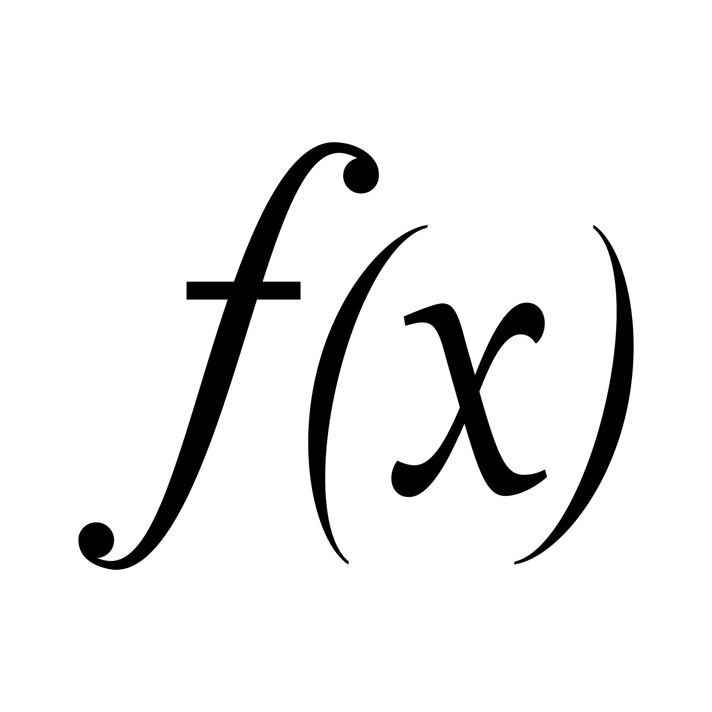

=======================
A Simple Smart Contract
=======================

Contract in sCrypt is conceptually similar to class in Object Oriented Programming.
Each contract provides a template for a certain type of contracts (e.g., P2PHK or multisig), which can be instantiated into concrete runnable contract objects.

.. code-block:: solidity
    
    contract Test {
        int x;

        constructor(int x) {
            this.x = x;
        }

        public function equal(int y) {
            require(y == this.x);
        }
    }

Constructor
===========
Each contract has at most one constructor. It is where contract member variables are initialized. 
For example, it can initialize the public key hash of a P2PHK contract, or the hash of a secret in a hash puzzle contract.

Default Constructor
-------------------
When no constructor is provided, the compiler will automatically generate a default constructor that initializes every member variable in the order they are declared.
For example,

.. code-block:: solidity
    
    contract Test {
        int x1;
        bytes x2;
        bool x3;

        public function equal(int y) {}
    }

is functionally equivalent to

.. code-block:: solidity
    
    contract Test {
        int x1;
        bytes x2;
        bool x3;

        constructor(int x1, bytes x2, bool x3) {
            this.x1 = x1;
            this.x2 = x2;
            this.x3 = x3;
        }

        public function equal(int y) {}
    }

require()
=========
The ``require()`` function specifies terms/conditions of a contract. It consumes a boolean condition. 
If the condition is not met, the contract will abort execution and fail. Otherwise, the execution will resume.

Public Function
=================
Each contract has at least one public function. It is denoted with the ``public`` keyword and does not return any value. The function body corresponds to locking script and its arguments unlocking script.
It is visible outside the contract and acts as the entry point into the contract (like ``main`` in ``C`` and ``Java``).

A public function must end with a ``require()`` call. ``require()`` can also appear in other parts of a public function. A contract can only be fulfilled and succeed when its called public function runs to completion without violating any conditions in ``require()``.
In the above example, only ``unlockingScript`` (i.e., ``y``) equal to ``this.x`` can fulfill the contract. 

A public function can be regarded as a mathematical boolean function. ``f`` is the function body and ``x`` the function arguments.
A contract call succeeds if and only if ``f(x)`` returns true.

Multiple Public Functions
-------------------------
A contract can have multiple public functions, representing different ways to fulfill a contract. Only one of the public functions can be called at a time. In this case, the last operator of ``unlockingScript`` has to be the index of the public function called, starting from ``0``.
For example, if public function ``larger`` is called, ``unlockingScript`` of ``y 2`` can fulfill the contract below, in which ``2`` is the public function index.

.. code-block:: solidity

    contract Test {
        int x;

        public function equal(int y) {
            require(y == this.x);
        }

        public function smaller(int y) {
            require(y < this.x);
        }

        public function larger(int y) {
            require(y > this.x);
        }
    }
