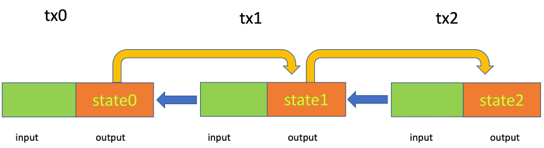

=================
Stateful Contract
=================

Bitcoin/sCrypt contract uses Unspent Transaction Output (UTXO) model: a contract is inside a UTXO, dictating how the bitcoins in the UTXO can be spent.
When a UTXO is spent (i.e., an sCrypt contract public function is called successfully), the contract is terminated.
For a contract to keep state and able to be called multiple times while carrying the mutable state, these steps have to be followed.

State Decorator
===============
Declare any property that is part of the state with a decorator ``@state``.
The state property can be used the same way as a regular property. Note, that an explicit constructor definition isn't allowed when the contract contains state properties.

.. code-block:: solidity

    contract Counter {
        @state
        int counter;
        
    }

Propagate the State
===================
A contract can keep state across chained transactions by storing it in the locking script.
In the following example, a contract goes from ``state0`` to ``state1``, and then to ``state2``.
Input in transaction 1 ``tx1`` is spending UTXO in ``tx0``, and ``tx2`` spending ``tx1``.

When you are ready to pass the new state into the output[s] in the current spending transaction, 
simply call a built-in function ``this.getStateScript()`` to get the locking script containing the latest stateful properties. 
It is automatically generated for every stateful contract, i.e., a contract that has at least one property decorated with ``@state``.

Finally, use :ref:`OP_PUSH_TX<pushtx-label>` to ensure the output[s] containing the state go into the current spending transaction.
The following is an example contract that records the number of times ``mutate()`` have been called.

.. code-block:: solidity

    contract Counter {
        @state
        int counter;

        constructor(int counter) {
            this.counter = counter;
        }
        
        public function increment(SigHashPreimage txPreimage, int amount) {
            require(Tx.checkPreimage(txPreimage));
    
            // mutate state
            this.counter++;

            // get the locking script containing the latest stateful properties
            bytes outputScript = this.getStateScript();

            // construct an output from its locking script and satoshi amount
            bytes output = Util.buildOutput(outputScript, amount);
            // only 1 input here
            require(hash256(output) == Util.hashOutputs(txPreimage));
        }
    }

Restrictions
============
For any public function to access a stateful property, it must include a ``SighashPreimage`` parameter that is validated with ``Tx.checkPreimage*()``, i.e., with :ref:`OP_PUSH_TX<pushtx-label>` .
This does not apply to any non-public function, including constructors.

.. code-block:: solidity

    contract Counter {
        @state
        int counter;

        constructor(int counter) {
            // OK: not a public function
            this.counter = counter;
        }
        
        public function increment(SigHashPreimage txPreimage, int amount) {    
            // OK
            this.counter++;

            require(Tx.checkPreimage(txPreimage));
        }

        public function foo(SigHashPreimage txPreimage, int amount) {
            require(Tx.checkPreimageOpt(txPreimage));
    
            // OK
            this.counter++;

            require(true);
        }

        public function bar(SigHashPreimage txPreimage) {
            // Not OK: missing Tx.checkPreimage*()
            this.counter++;

            require(true);
        }

        public function baz(int i) {
            // Not OK: missing SigHashPreimage
            this.counter++;

            require(true);
        }

        function baz() : int {
            // OK: not a public function
            return this.counter;
        }
    }
